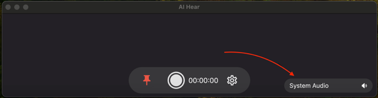

## When to Use AI Hear? 🎧
When streaming videos, music, or live content, simply open AI Hear for real-time transcription, saving both the audio and text translations:
- **📺** YouTube, Netflix, BBC iPlayer, and more. 
- **👂** Spotify, Apple Podcasts, Stitcher, and others. 
- **📚** Audible, Google Play Books, LibriVox, and more. 
- **🎓** Enhance your learning with Khan Academy, Coursera, and Udemy.
- **💬** Seamlessly join online meetings with Teams, Slack, or Zoom.
- **🗣️** Try using real-time translations during face-to-face discussions or consultations; it might help those with hearing impairments follow along more easily and enhance daily interactions.

## Which Model Should I Choose? 🤖
AI Hear utilizes OpenAI Whisper, a privacy protection technology developed by OpenAI to ensure user data privacy and security:
- **Tiny:** Set as the default, prioritizing speed while maintaining moderate accuracy. With its swift translation capabilities, it's ideal for fast-paced interactions where immediate transcription is crucial.
- **Base or Small:** Keeps transcription delay under 1 second with better accuracy.
- **Larger Models:** Provides a transcription delay of about 5 seconds, ideal for recording and reviewing later with excellent accuracy.

## How to Change Audio Source? 🔊

AI Hear collects audio from your MacBook and transcribes it using local processing, ensuring your privacy. You can customize the audio source:
- **System Audio**: Captures all system sounds, including browser, app music, video players, and macOS system sounds.
- **Microphone**: Captures audio through a connected microphone, ideal for recording spoken words.
- **Specific Application**: Select a specific app (e.g., Safari, Google Chrome, Zoom). Only audio from the selected app is recorded and transcribed, even when muted.

## How to Download AI Hear?
Click [AI Hear](https://apps.apple.com/app/ai-hear/id6497877058) to start the download.