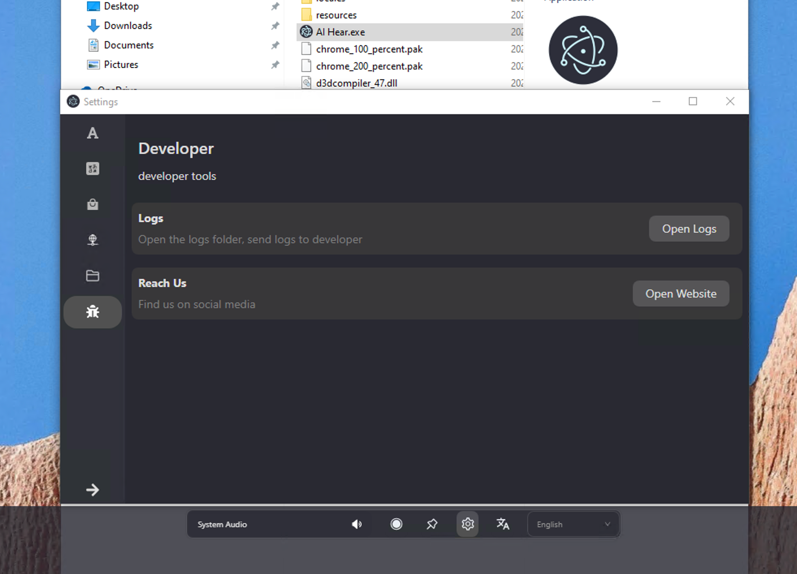

If you don't have an NVIDIA or AMD graphics card, we don't recommend trying AI Hear. Local real-time speech-to-text requires significant computing power. Using CPU for transcription will result in slow response times and a poor user experience.

## GPU Support

Currently, both NVIDIA and AMD graphics cards are supported.

AI Hear's underlying technology shares the same foundation as Ollama, so theoretically, any NVIDIA/AMD graphics card supported by Ollama should also work with AI Hear.

Click [Ollama supported graphics cards list](https://github.com/ollama/ollama/blob/main/docs/gpu.md) to view the graphics cards supported by Ollama.

## Download

### GitHub Download Link

https://github.com/lwtlab/hear/releases

### Baidu Cloud Storage

https://pan.baidu.com/s/1h1MdVzrpyhkagjuJSQJQdg?pwd=dzat

## Support Us

If you find this useful, you can [purchase an activation code](https://checkout.thucydides.net/purchase/AIHear) to support us.

The activation code removes the 15-minute limitation and unlocks future premium features.

## Feedback

Provide feedback through Discord.
Send feedback via email.

### Getting Runtime Logs

