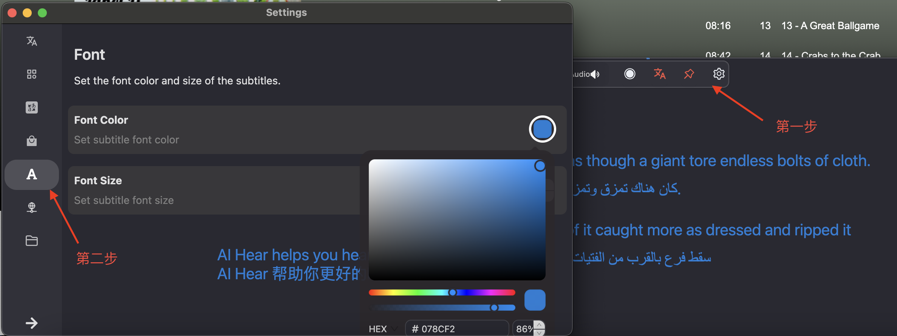
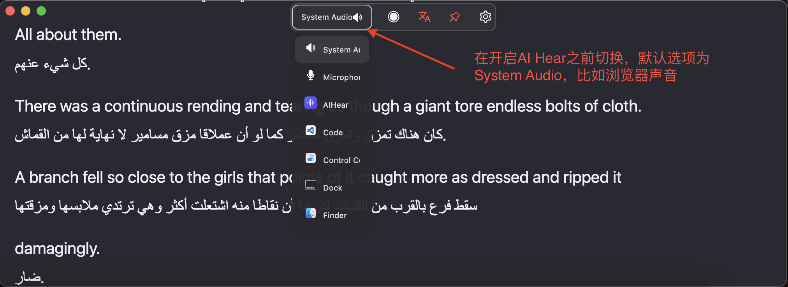

## 在什么时候用 AI Hear? 🎧
- **📺视频** YouTube, Netflix, BBC, iPlayer.
- **👂播客** Spotify, Apple Podcasts, Stitcher.
- **📚有声书** Audible, Google Play Books, LibriVox.
- **🎓公开课** Khan Academy, Coursera、Udemy.
- **🗣️开会、💬视频聊天、📞接打电话** Teams, Slack, Zoom.

1. 网课、开会、观看视频、收听播客时打开 AI Hear 点击开始按钮进行实时录制和翻译。

2. 完成录制后 AI Hear 会自动保存原文、译文、音频、时间轴，方便日后导出。

3. 帮助听障者
  
   除以上用途外，面对面交谈时开启 AI Hear，切换声音来源为麦克风并请对方通过麦克风说话。

    ***提示*** 您可以调整字体大小和颜色。

   

---
## 如何设置声音来源？ 🔊
AI Hear 通过您的电脑录音后使用本地处理转录，确保您的隐私。

- **System Audio** 声音来自浏览器、扬声器或 macOS 系统。
- **Microphone** 声音来自麦克风。
- **其它选项** 声音来自某一款应用程序（比如来自腾讯会议、飞书会议、视频播放器等）。

    ***提示*** 将正在播放的视频、音频静音后,不影响录制和翻译。

---

## 选择哪个模型？ 🤖
初试默认模型为 Tiny - 75 MB(保障翻译速度的同时保持适当的准确性)，通常模型越大翻译延迟越长，准确性越高，您可以轻松下载尝试找到适合自身用途的模型，然后删除那些不需要的。

***提示*** 

我们会根据 AI 模型的变更择优迭代供您选择。

我们会收集意见、结合测试和日常使用结果，针对特定场景进行推荐。

---

## 如何下载 AI Hear?
 [macOS免费下载](https://apps.apple.com/app/ai-hear/id6497877058) 