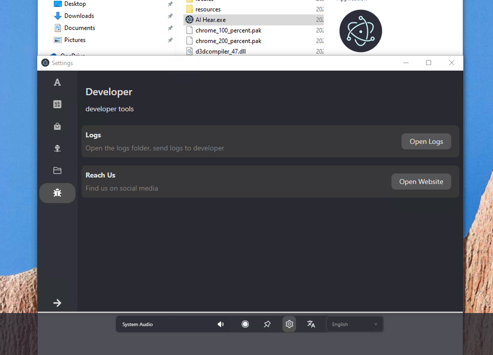

如果没有 NVIDIA 显卡和 AMD 显卡，不建议试用 AI Hear。本地实时语音转文字需要消耗大量算力，如果使用 CPU 进行转文字，转文字的响应速度会很慢，体验很差。

## GPU 支持

目前支持 NVIDIA 显卡和 AMD 显卡。

AI Hear 底层技术与 Ollama 底层技术同源，理论上 Ollama 支持的 NVIDIA/AMD 显卡 AI Hear 都支持。

点击 [Ollama 支持的显卡列表](https://github.com/ollama/ollama/blob/main/docs/gpu.md) 查看 Ollama 支持的显卡列表。

已知问题：NVIDIA 50 系列未适配。

## 下载

### Github 下载地址

https://github.com/lwtlab/hear/releases

### 百度网盘

https://pan.baidu.com/s/1h1MdVzrpyhkagjuJSQJQdg?pwd=dzat

## 反馈

通过 Discord 反馈问题。
通过 邮件 反馈问题。

### 获取运行日志

