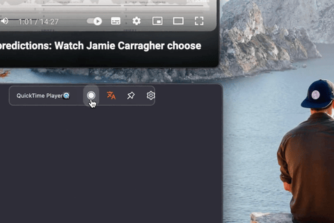

---

import { Card, CardGrid } from "@astrojs/starlight/components";

## 特点

<CardGrid stagger>
	<Card title="硬件要求" icon="pencil" style="width: 20px; height: 10px;">
	1. macOS 系统。
	2. M1及以上系列芯片。
	3. 即将支持 Windows 系统。

</Card>
	<Card title="主要功能" icon="add-document">
	1. 录音：软件内选择系统声音、麦克风或指定软件，如腾讯会议、浏览器、播放器（免音频驱动）。
	2. 语音识别：基于 OpenAI Whisper 模型的语音转文字。
	3. 翻译：软件内自由切换引擎，支持 Ollama，OpenAI 等开放接口格式。
	4. 保存：完成录制后自动保存音频、原本、译文、时间轴。
	5. 导出：格式支持 SRT，TXT，VTT，WAV。
</Card>
	<Card title="使用场景" icon="setting">
    1. 线上会议、网课播客、游戏直播、视频通话。
	2. 外教课堂、原版影视、通勤路上。
	3. 收集外文资料、记录会议内容、学习语言、练习口语。
</Card>
	<Card title="为何选择 AI Hear" icon="open-book">
	1. 完全本地运行，不收集数据，保护隐私。
	2. 相比市面上的实时翻译更具性价比。
	3. 定期收集用户建议，针对性的迭代优化。
	4. 持续跟进 AI 技术变革，扩充产品功能。
</Card>
</CardGrid>
