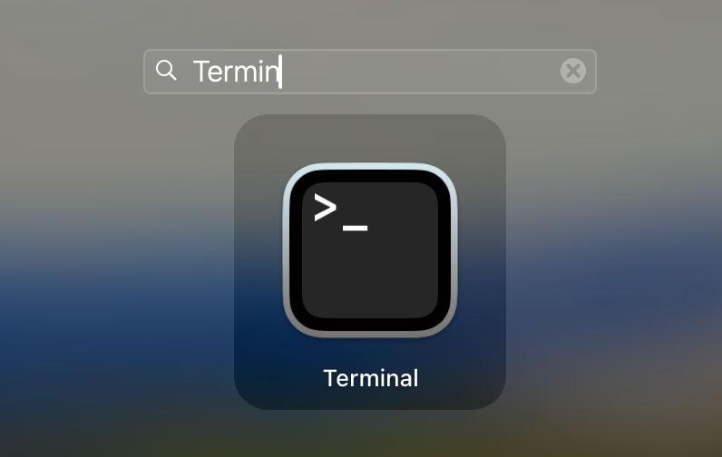
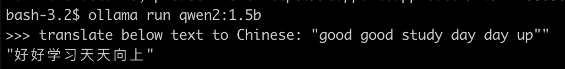
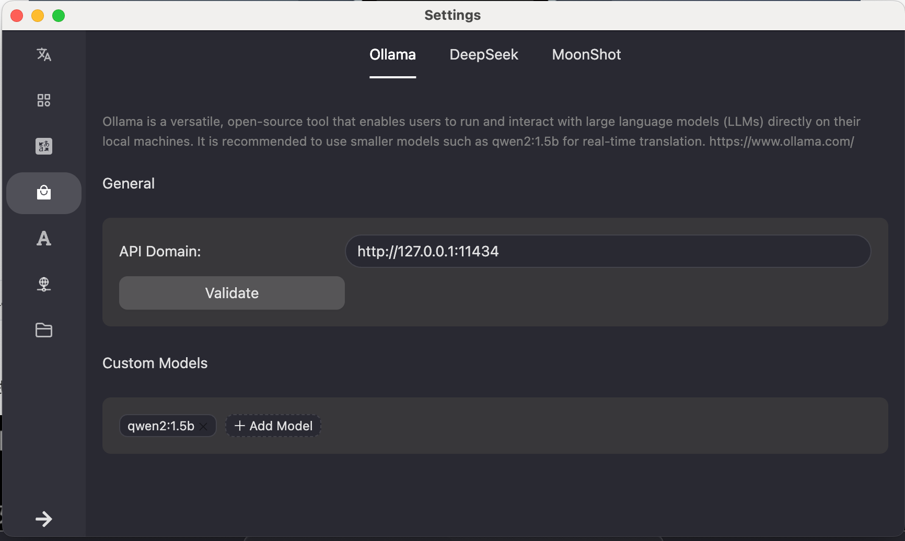
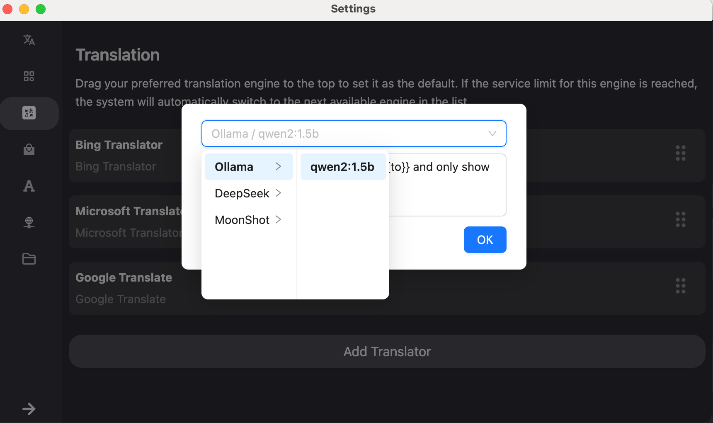
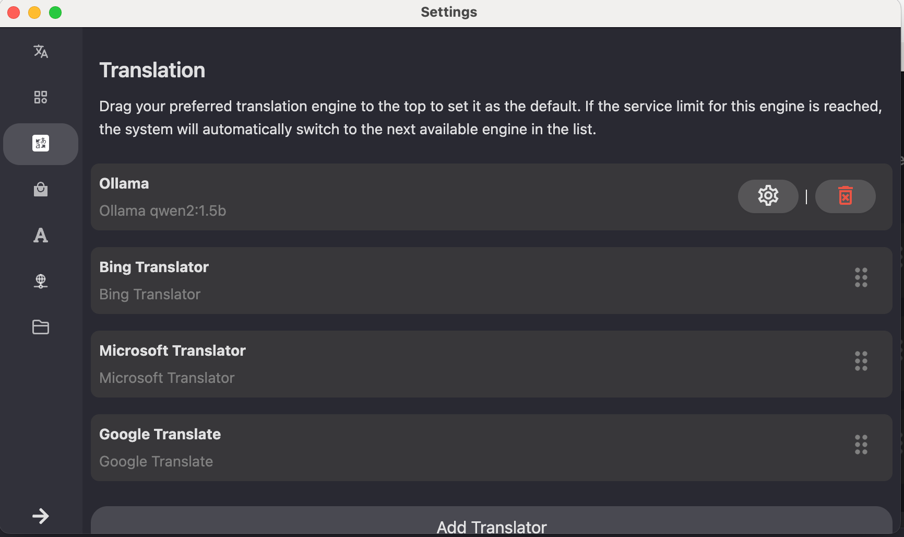

## 准备工作

### 本地翻译模型

我们将使用 [Ollama](https://ollama.com) 来运行本地的翻译模型。

1. 首先下载 Ollama 软件：https://ollama.com/download

2. 按照软件指引安装 Ollama

3. 启动 Ollama。一切顺利的话，你将在 menu bar 里看到这个小羊驼🦙


4. 下载模型，这里我们以 [qwen2](https://ollama.com/library/qwen2) 为例。打开终端程序，输入命令，等待模型下载。



```bash
ollama run qwen2:1.5b
```


5. 测试下，试着翻译一句英文。



### 注意⚠️

为了良好的体验，根据自己的机型选择合适的模型。一般来说，模型越大，翻译效果越好，对电脑的要求也越高。

### AI Hear 配置

1. 打开 Providers（供应商）界面，如下配置：



2. 打开 Translation（翻译）界面，Add Translator（添加翻译引擎），选择供应商、模型：



3. 将新增的翻译引擎拖拽到顶部：



## 正常使用

现在关闭配置界面，我们就可以正常使用。

