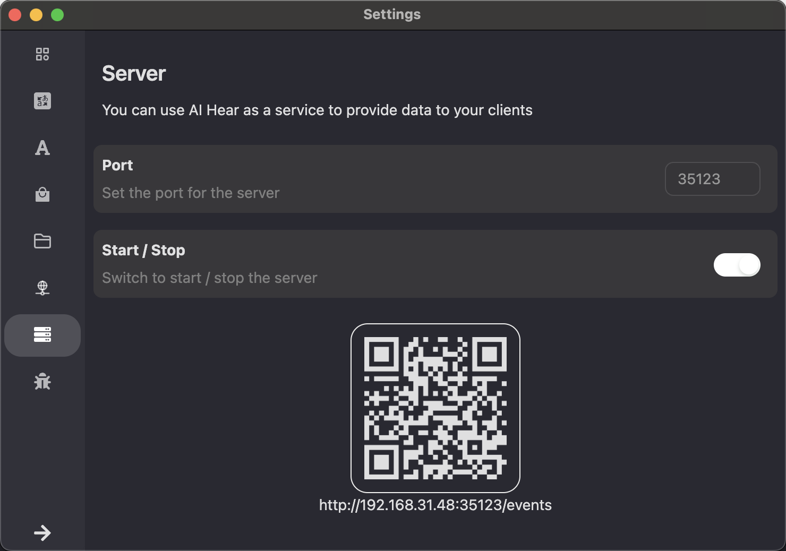

AI Hear 还提供了将转录数据发送给其他客户端的能力，帮助其他客户端快速低成本的实现实时语音转写、翻译等功能。

## 一、准备工作

- 安装支持 Web Server 的 AI Hear 版本
- 打开应用并启动 Web Server

  > 💡 某些定制版本的 AI Hear 可能会在应用启动的时候默认打开

  

## 二、快速开始

```bash
# 1、订阅 Server-Sent Events
curl -v -N -H "Accept: text/event-stream" http://localhost:35123/events

# 2、开始转录
curl "http://localhost:35123/start?source=system&model=tiny&lang_from=en&lang_to=zh-Hans"

# 3、停止转录
curl "http://localhost:35123/stop"
```

## 三、接口

### 1、/start - 开始转录

- method `GET` `POST`

- request

| 参数名    | 类型   | 描述     | 是否必须 | 默认值 | 备注                                                                               |
| --------- | ------ | -------- | -------- | ------ | ---------------------------------------------------------------------------------- |
| source    | string | 音频源   | 否       | system | system 或 microphone                                                               |
| model     | string | 语音模型 | 否       | tiny   | 可以是[内置模型](#2内置模型列表)或者外部模型：内置模型传模型名，外部模型传绝对地址 |
| lang_from | string | 音频语言 | 否       | auto   | [语言代码](#3语言列表)，例如：zh-Hans、en                                          |
| lang_to   | string | 翻译语言 | 否       | n/a    | [语言代码](#3语言列表)，例如：zh-Hans、en                                          |

- response

| 参数名  | 类型   | 描述     |
| ------- | ------ | -------- |
| code    | int    | 状态码   |
| message | string | 描述信息 |
| data    | object | 数据     |

### 2、/stop - 停止转录

- method `GET` `POST`

- request

| 参数名 | 类型 | 描述 | 是否必须 | 默认值 | 备注 |
| ------ | ---- | ---- | -------- | ------ | ---- |

- response

| 参数名  | 类型   | 描述     |
| ------- | ------ | -------- |
| code    | int    | 状态码   |
| message | string | 描述信息 |
| data    | object | 数据     |

### 3、/events - 订阅 Server-Sent Events

| 事件      | 描述     | 备注 |
| --------- | -------- | ---- |
| captions  | 转录字幕 |      |
| translate | 字幕翻译 |      |
| ping      | 心跳     |      |
| open      | 连接建立 |      |
| close     | 连接关闭 |      |
| error     | 错误信息 |      |

## 四、进阶


### 1、浏览器里订阅事件
```js
// 浏览器里 console 里面粘贴下面的代码
const eventSource = new EventSource('http://localhost:35123/events');
eventSource.onopen = (e) => console.log('Connection opened', e);
eventSource.onerror = (e) => console.log('Connection error', e);
eventSource.addEventListener('captions', (e) => {
  console.log('captions:', JSON.parse(e.data));
});
eventSource.addEventListener('translate', (e) => {
  console.log('translate:', JSON.parse(e.data));
});
```

### 2、订阅事件

#### captions 事件

```json
// 1
{
  "index": 0, // 行号
  "captions": {
    "startTime": 0.098, // 开始时间
    "endTime": 1.2599999904632568, // 结束时间
    "text": "的老师快转吧。", // 语音转出来的文本
    "subSegments": [ // 子片段，为了实现实时效果，最后一个 index 的 text 可能还会变动
      {
        "index": 0,
        "startTime": 0.098,
        "endTime": 1.2599999904632568,
        "text": "的老师快转吧。"
      }
    ],
    "fixed": false // 是否固定下来了，固定的话就不会变动
  }
}

// 2
{
  "index": 0,
  "captions": {
    "startTime": 0.1640000194311142,
    "endTime": 16.47599828720093,
    "text": "的老师快转吧，我们上车了，看看能转多久。那么现在的问题是啊，我们怎么开出去呢？哎呀，怎么说？ 他们造完才发现，他们压根没想这事儿，棚子里造的门太小，开不过去。就是你说因为他造这个实验，他这个门儿。",
    "subSegments": [
      {
        "index": 0,
        "startTime": 0.1640000194311142,
        "endTime": 6.722000019431114,
        "text": "的老师快转吧，我们上车了，看看能转多久。那么现在的问题是啊，我们怎么开出去呢？哎呀，怎么说？"
      },
      {
        "index": 1,
        "startTime": 6.845998287200928,
        "endTime": 16.47599828720093,
        "text": "他们造完才发现，他们压根没想这事儿，棚子里造的门太小，开不过去。就是你说因为他造这个实验，他这个门儿。"
      }
    ],
    "fixed": true,
    "translateText": "Let's get on the bus and see how long we can turn. So the question now is, how do we drive out? Oops, how to say?"
  }
}

// 3
{
  "index": 1,
  "captions": {
    "startTime": 16.833997741699218,
    "endTime": 18.70006024169922,
    "text": "早些不想好自己零家咔咔。",
    "subSegments": [
      {
        "index": 2,
        "startTime": 16.833997741699218,
        "endTime": 18.70006024169922,
        "text": "早些不想好自己零家咔咔。"
      }
    ],
    "fixed": false
  }
}

```

#### translate 事件

> ⚠️ 翻译的过程是异步的，可能会有一定的延迟，需要按照 index 来更新字幕

```json
// 1
{
  "index": 0,
  "captions": {
    "startTime": 0.1640000194311142,
    "endTime": 16.47599828720093,
    "text": "的老师快转吧，我们上车了，看看能转多久。那么现在的问题是啊，我们怎么开出去呢？哎呀，怎么说？ 他们造完才发现，他们压根没想这事儿，棚子里造的门太小，开不过去。就是你说因为他造这个实验，他这个门儿。",
    "subSegments": [
      {
        "index": 0,
        "startTime": 0.1640000194311142,
        "endTime": 6.722000019431114,
        "text": "的老师快转吧，我们上车了，看看能转多久。那么现在的问题是啊，我们怎么开出去呢？哎呀，怎么说？"
      },
      {
        "index": 1,
        "startTime": 6.845998287200928,
        "endTime": 16.47599828720093,
        "text": "他们造完才发现，他们压根没想这事儿，棚子里造的门太小，开不过去。就是你说因为他造这个实验，他这个门儿。"
      }
    ],
    "fixed": true,
    "translateText": "Let's get on the bus and see how long we can turn. So the question now is, how do we drive out? Oops, how to say? When they finished building, they found that they hadn't thought about it at all, and the door in the shed was too small to open. That's what you said because he made this experiment, because he made this door."
  }
}

// 2
{
  "index": 1,
  "captions": {
    "startTime": 16.83399772644043,
    "endTime": 27.700060455322266,
    "text": "早些不想好，自己零家咔咔噔拼起来来，发现诶。 这个门太小了，开不出去。也从另一个层面也说做事专注啊，就没想别的事儿，就想先怎么么把这个车弄出来，也很难想象是发明家。",
    "subSegments": [
      {
        "index": 2,
        "startTime": 16.83399772644043,
        "endTime": 19.71199772644043,
        "text": "早些不想好，自己零家咔咔噔拼起来来，发现诶。"
      },
      {
        "index": 3,
        "startTime": 19.845997955322265,
        "endTime": 27.700060455322266,
        "text": "这个门太小了，开不出去。也从另一个层面也说做事专注啊，就没想别的事儿，就想先怎么么把这个车弄出来，也很难想象是发明家。"
      }
    ],
    "fixed": false,
    "translateText": "I didn't want to be good earlier, so I put it together and found it."
  }
}

```

### 3、字幕处理

- 创建一个数组 lines 并根据 index 维护;
- 每当有订阅事件过来，更新此 index 的元素；
- 将 lines 数组渲染到页面上。参考代码如下：

```js
{
  line.subSegments ? line.subSegments.map((item: CaptionModel, index: number) => {
    return (
      <span key={index} style={{ opacity: !line.fixed && index == line.subSegments.length - 1 ? 0.5 : 1 }}>
        {item.text}
      </span>
    );
  }) : line.text
}
```


### 4、端口号

- 默认端口号：35123
- 可以通过环境变量 `HEAR_WEB_SERVER_PORT` 来设置端口号


## 五、附录

### 1、错误码

| 错误码 | 描述         |
| ------ | ------------ |
| 200    | 成功         |
| 500    | 失败         |
| 5001   | 已经开始转录 |
| 5002   | 还未开始转录 |
| 5003   | 参数错误     |

### 2、内置模型列表

> ⚠️ 模型使用前需要提前下载到本地

| model               | lang                        | tag                                   | repo                  | repoFile                        | desc                                                                                              | disk   | size       | mem     | sha                                      |
| ------------------- | --------------------------- | ------------------------------------- | --------------------- | ------------------------------- | ------------------------------------------------------------------------------------------------- | ------ | ---------- | ------- | ---------------------------------------- |
| tiny                |                             | ["realtime", "tiny"]                  | ggerganov/whisper.cpp | ggml-tiny.bin                   | Very fast but bad accuracy                                                                        | 75 MB  | 77691713   | ~390 MB | bd577a113a864445d4c299885e0cb97d4ba92b5f |
| tiny.en             | ["en"]                      | ["realtime", "tiny"]                  | ggerganov/whisper.cpp | ggml-tiny.en.bin                | Very fast but bad accuracy. English only.                                                         | 75 MB  | 77704715   | ~390 MB | c78c86eb1a8faa21b369bcd33207cc90d64ae9df |
| base                |                             | ["realtime", "base"]                  | ggerganov/whisper.cpp | ggml-base.bin                   | Fast with decent accuracy                                                                         | 142 MB | 147951465  | ~500 MB | 465707469ff3a37a2b9b8d8f89f2f99de7299dac |
| base.en             | ["en"]                      | ["realtime", "base"]                  | ggerganov/whisper.cpp | ggml-base.en.bin                | Fast with decent accuracy. English only.                                                          | 142 MB | 147964211  | ~500 MB | 137c40403d78fd54d454da0f9bd998f78703390c |
| sensevoice.small    | ["zh","en","yue","ja","ko"] | ["realtime","sensevoice","quantized"] | xumo/sense-voice-gguf | gguf-fp16-sense-voice-small.bin | Experimental. SenseVoice Small is an open-source speech recognition model developed by Alibaba... | 466 MB | 469406560  | ~1.0 GB | 8176595ec830f32f385ca6d28ad86008db88de32 |
| small               |                             | ["realtime", "small"]                 | ggerganov/whisper.cpp | ggml-small.bin                  | Normal speed with good accuracy                                                                   | 466 MB | 487601967  | ~1.0 GB | 55356645c2b361a969dfd0ef2c5a50d530afd8d5 |
| small.en            | ["en"]                      | ["realtime", "small"]                 | ggerganov/whisper.cpp | ggml-small.en.bin               | Normal speed with good accuracy. English only.                                                    | 466 MB | 487614201  | ~1.0 GB | db8a495a91d927739e50b3fc1cc4c6b8f6c2d022 |
| medium              |                             | ["medium"]                            | ggerganov/whisper.cpp | ggml-medium.bin                 | Warning: Only suitable for file transcription (coming soon). Slow but great accuracy              | 1.5 GB | 1533763059 | ~2.6 GB | fd9727b6e1217c2f614f9b698455c4ffd82463b4 |
| ggml-medium-q5_0    |                             | ["medium", "quantized"]               | ggerganov/whisper.cpp | ggml-medium-q5_0.bin            | Slow but great accuracy                                                                           | 539 MB | 539212467  | ~1.0 GB | 7718d4c1ec62ca96998f058114db98236937490e |
| medium.en           | ["en"]                      | ["medium"]                            | ggerganov/whisper.cpp | ggml-medium.en.bin              | Warning: Only suitable for file transcription (coming soon). Slow but great accuracy              | 1.5 GB | 1533774781 | ~2.6 GB | 8c30f0e44ce9560643ebd10bbe50cd20eafd3723 |
| large-v3-turbo-q5_0 |                             | ["realtime", "large"]                 | ggerganov/whisper.cpp | ggml-large-v3-turbo-q5_0.bin    | Whisper large-v3-turbo is a finetuned version of a pruned Whisper large-v3.                       | 574 MB | 574041195  | ~?? GB  | e050f7970618a659205450ad97eb95a18d69c9ee |
| large-v2            |                             | ["large"]                             | ggerganov/whisper.cpp | ggml-large-v2.bin               | Warning: Only suitable for file transcription (coming soon). Most accurate transcription...       | 2.9 GB | 3094623691 | ~4.7 GB | 0f4c8e34f21cf1a914c59d8b3ce882345ad349d6 |
| large-v3            |                             | ["large"]                             | ggerganov/whisper.cpp | ggml-large-v3.bin               | Warning: Only suitable for file transcription (coming soon). Most accurate transcription...       | 2.9 GB | 3095033483 | ~4.7 GB | ad82bf6a9043ceed055076d0fd39f5f186ff8062 |
| ggml-large-v2-q5_0  |                             | ["large", "quantized"]                | ggerganov/whisper.cpp | ggml-large-v2-q5_0.bin          | Most accurate transcription, updated model but can have repetition in transcript                  | 1.1 GB | 1080732091 | 2 GB    | 00e39f2196344e901b3a2bd5814807a769bd1630 |

### 3、语言列表

> ⚠️ 以下两个是特殊的 code
>
> - auto 是指音频语言由语音模型自动检测。【仅音频语言使用】
> - n/a 是指翻译语言不需要翻译。【仅翻译语言使用】

| code     | name                  | displayName      | whisperCode | whisperPrompt        | bingCode | googleCode |
| -------- | --------------------- | ---------------- | ----------- | -------------------- | -------- | ---------- |
| auto     | Auto                  | Auto-Detect      |             |                      |          |            |
| n/a      | n/a                   | None             |             |                      |          |            |
| en       | English               | English          | en          |                      | en       | en         |
| zh-Hans  | Chinese Simplified    | 简体中文         | zh          | 以下是普通话的句子。 | zh-Hans  | zh-CN      |
| zh-Hant  | Chinese Traditional   | 繁體中文         | zh          | 以下是普通話的句子。 | zh-Hant  | zh-TW      |
| de       | German                | Deutsch          | de          |                      | de       | de         |
| es       | Spanish               | Español          | es          |                      | es       | es         |
| ru       | Russian               | Русский          | ru          |                      | ru       | ru         |
| ko       | Korean                | 한국어           | ko          |                      | ko       | ko         |
| fr       | French                | Français         | fr          |                      | fr       | fr         |
| ja       | Japanese              | 日本語           | ja          |                      | ja       | ja         |
| pt       | Portuguese            | Português        | pt          |                      | pt       | pt         |
| tr       | Turkish               | Türkçe           | tr          |                      | tr       | tr         |
| pl       | Polish                | Polski           | pl          |                      | pl       | pl         |
| ca       | Catalan               | Català           | ca          |                      | ca       | ca         |
| nl       | Dutch                 | Nederlands       | nl          |                      | nl       | nl         |
| ar       | Arabic                | العربية          | ar          |                      | ar       | ar         |
| sv       | Swedish               | Svenska          | sv          |                      | sv       | sv         |
| it       | Italian               | Italiano         | it          |                      | it       | it         |
| id       | Indonesian            | Bahasa Indonesia | id          |                      | id       | id         |
| hi       | Hindi                 | हिन्दी           | hi          |                      | hi       | hi         |
| fi       | Finnish               | Suomi            | fi          |                      | fi       | fi         |
| vi       | Vietnamese            | Tiếng Việt       | vi          |                      | vi       | vi         |
| he       | Hebrew                | עברית            | he          |                      | he       | null       |
| uk       | Ukrainian             | Українська       | uk          |                      | uk       | uk         |
| el       | Greek                 | Ελληνικά         | el          |                      | el       | el         |
| ms       | Malay                 | Bahasa Melayu    | ms          |                      | ms       | ms         |
| cs       | Czech                 | Čeština          | cs          |                      | cs       | cs         |
| ro       | Romanian              | Română           | ro          |                      | ro       | ro         |
| da       | Danish                | Dansk            | da          |                      | da       | da         |
| hu       | Hungarian             | Magyar           | hu          |                      | hu       | hu         |
| ta       | Tamil                 | தமிழ்            | ta          |                      | ta       | ta         |
| no       | Norwegian             | Norsk            | no          |                      | null     | no         |
| th       | Thai                  | ไทย              | th          |                      | th       | th         |
| ur       | Urdu                  | اردو             | ur          |                      | ur       | ur         |
| hr       | Croatian              | Hrvatski         | hr          |                      | hr       | hr         |
| bg       | Bulgarian             | Български        | bg          |                      | bg       | bg         |
| lt       | Lithuanian            | Lietuvių         | lt          |                      | lt       | lt         |
| la       | Latin                 | null             | la          |                      | null     | la         |
| mi       | Maori                 | Māori            | mi          |                      | mi       | mi         |
| ml       | Malayalam             | മലയാളം           | ml          |                      | ml       | ml         |
| cy       | Welsh                 | Cymreig          | cy          |                      | cy       | cy         |
| sk       | Slovak                | Slovenčina       | sk          |                      | sk       | sk         |
| te       | Telugu                | తెలుగు           | te          |                      | te       | te         |
| fa       | Persian               | فارسی            | fa          |                      | fa       | fa         |
| lv       | Latvian               | Latviešu         | lv          |                      | lv       | lv         |
| bn       | Bengali               | বাঙ্গালি         | bn          |                      | bn       | bn         |
| sr       | Serbian               | Српски           | sr          |                      | null     | sr         |
| az       | Azerbaijani           | Azərbaycan       | az          |                      | az       | az         |
| sl       | Slovenian             | Slovenščina      | sl          |                      | sl       | sl         |
| kn       | Kannada               | ಕನ್ನಡ            | kn          |                      | kn       | kn         |
| et       | Estonian              | Eesti            | et          |                      | et       | et         |
| mk       | Macedonian            | Македонски       | mk          |                      | mk       | mk         |
| br       | Breton                | null             | br          |                      | null     | null       |
| eu       | Basque                | Euskaldun        | eu          |                      | eu       | eu         |
| is       | Icelandic             | Íslenska         | is          |                      | is       | is         |
| hy       | Armenian              | Հայերեն          | hy          |                      | hy       | hy         |
| ne       | Nepali                | नेपाली           | ne          |                      | ne       | ne         |
| mn       | Mongolian             | null             | mn          |                      | null     | mn         |
| bs       | Bosnian               | Bosanski         | bs          |                      | bs       | bs         |
| kk       | Kazakh                | Қазақша          | kk          |                      | kk       | kk         |
| sq       | Albanian              | Shqip            | sq          |                      | sq       | sq         |
| sw       | Swahili               | Kiswahili        | sw          |                      | sw       | sw         |
| gl       | Galician              | GALEGO           | gl          |                      | gl       | gl         |
| mr       | Marathi               | मराठी            | mr          |                      | mr       | mr         |
| pa       | Punjabi               | ਪੰਜਾਬੀ           | pa          |                      | pa       | pa         |
| si       | Sinhala               | සිංහල            | si          |                      | si       | si         |
| km       | Khmer                 | ខ្មែរ            | km          |                      | km       | km         |
| sn       | Shona                 | Shona            | sn          |                      | sn       | sn         |
| yo       | Yoruba                | Yoruba           | yo          |                      | yo       | yo         |
| so       | Somali                | Soomaalida       | so          |                      | so       | so         |
| af       | Afrikaans             | Afrikaans        | af          |                      | af       | af         |
| oc       | Occitan               | null             | oc          |                      | null     | null       |
| ka       | Georgian              | ქართული          | ka          |                      | ka       | ka         |
| be       | Belarusian            | null             | be          |                      | null     | be         |
| tg       | Tajik                 | null             | tg          |                      | null     | tg         |
| sd       | Sindhi                | سنڌي             | sd          |                      | sd       | sd         |
| gu       | Gujarati              | ગુજરાતી          | gu          |                      | gu       | gu         |
| am       | Amharic               | አማርኛ             | am          |                      | am       | am         |
| yi       | Yiddish               | null             | yi          |                      | null     | yi         |
| lo       | Lao                   | Lao              | lo          |                      | lo       | lo         |
| uz       | Uzbek                 | O'zbek tili      | uz          |                      | uz       | uz         |
| fo       | Faroese               | Føroyskt         | fo          |                      | fo       | null       |
| ht       | Haitian Creole        | Kreyòl Ayisyen   | ht          |                      | ht       | ht         |
| ps       | Pashto                | پښتو             | ps          |                      | ps       | ps         |
| tk       | Turkmen               | Türkmençe        | tk          |                      | tk       | tk         |
| nn       | Nynorsk               | null             | nn          |                      | null     | null       |
| mt       | Maltese               | Malti            | mt          |                      | mt       | mt         |
| sa       | Sanskrit              | null             | sa          |                      | null     | sa         |
| lb       | Luxembourgish         | null             | lb          |                      | null     | lb         |
| my       | Myanmar               | မြန်မာနိုင်ငံ    | my          |                      | my       | my         |
| bo       | Tibetan               | བོད་སྐད།         | bo          |                      | bo       | null       |
| tl       | Tagalog               | null             | tl          |                      | null     | tl         |
| mg       | Malagasy              | Malagasy         | mg          |                      | mg       | mg         |
| as       | Assamese              | অসমীয়া          | as          |                      | as       | as         |
| tt       | Tatar                 | Татар            | tt          |                      | tt       | tt         |
| haw      | Hawaiian              | null             | haw         |                      | null     | haw        |
| ln       | Lingala               | Lingala Lingala  | ln          |                      | ln       | ln         |
| ha       | Hausa                 | Hausa            | ha          |                      | ha       | ha         |
| ba       | Bashkir               | Башҡорттар       | ba          |                      | ba       | null       |
| jw       | Javanese              | null             | jw          |                      | null     | null       |
| su       | Sundanese             | null             | su          |                      | null     | su         |
| yue-Hans | Cantonese Simplified  | 简体粤语         | yue         | 以下是普通话的句子。 | yue      | null       |
| yue-Hant | Cantonese Traditional | 繁體粤语         | yue         | 以下是普通話的句子。 | yue      | null       |

## 五、相关链接

- Server-Sent Events
  - [mdn web docs](https://developer.mozilla.org/en-US/docs/Web/API/Server-sent_events)
  - [ruanyifeng.com](https://www.ruanyifeng.com/blog/2017/05/server-sent_events.html)
